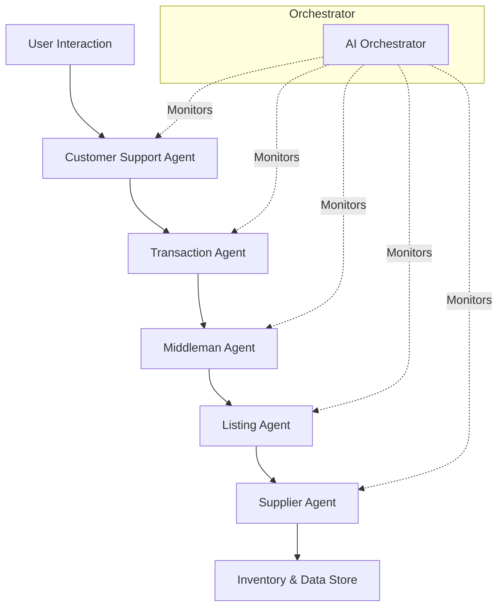

# Agent Swarm Blueprint: Autonomous AI-Driven Commerce Ecosystem

Welcome to the theoretical blueprint for the **Agent Swarm** – an innovative and decentralized architecture designed to orchestrate commerce entirely through a network of autonomous AI agents. This system is built to seamlessly integrate on-chain transactions (e.g., using Solana) with real-world commerce, deploying a swarm of specialized agents that manage every facet of the commerce process.

> **Note:** This document serves as a theoretical design and blueprint. Implementation details, technology choices, and integrations may evolve over time as the project matures.

## Table of Contents
- [Overview](#overview)
- [Design Goals](#design-goals)
- [Architectural Blueprint](#architectural-blueprint)
  - [Key Components](#key-components)
  - [Agent Roles & Responsibilities](#agent-roles--responsibilities)
- [Communication & Data Flow](#communication--data-flow)
- [Blueprint Diagrams](#blueprint-diagrams)
- [Implementation Guidelines](#implementation-guidelines)
- [Scalability & Security Considerations](#scalability--security-considerations)
- [Roadmap & Future Work](#roadmap--future-work)
- [Conclusion](#conclusion)

## Overview

The **Agent Swarm** envisions a fully autonomous ecosystem where intelligent agents coordinate to handle all aspects of digital and physical commerce. By leveraging decentralized technologies and on-chain transactions, the system mitigates single points of failure while optimizing efficiency and security.

The core of this blueprint includes:
- A decentralized network of agents, each specialized in a unique role (Supplier, Listing, Transaction, Customer Support, and Middleman).
- Deep integration with blockchain networks (e.g., Solana) to secure and verify every transaction on-chain.
- An AI orchestration layer that manages cross-agent communication, decision-making, and self-optimization.

## Design Goals

- **Autonomy:** Empower each agent to make intelligent decisions using AI/ML techniques.
- **Decentralization:** Reduce central points of control, using blockchain for secure, tamper-proof transaction logging.
- **Scalability:** Ensure the system can scale horizontally by independently deploying and updating agents.
- **Resilience:** Design architecture that tolerates faults, enabling self-healing and adaptive recovery.
- **Transparency & Security:** Leverage on-chain data for all transactions and interactions, ensuring a high level of trust and transparency.

## Architectural Blueprint

### Key Components

1. **AI Orchestrator:**  
   The central brain that oversees agent interactions, event routing, monitoring, logging, and policy management. It uses an event-driven approach with message brokers to keep the system in sync.

2. **Agent Services:**  
   Specialized microservices, each implementing a unique capability:
   - **Supplier Agent:** Validates vendors, manages inventory, and ensures product authenticity.
   - **Listing Agent:** Automates product cataloging, handles updates, and maintains accurate product metadata.
   - **Transaction Agent:** Manages on-chain payments and token transfers, ensuring secure and verifiable transactions using Solana blockchain APIs.
   - **Customer Support Agent:** Utilizes Natural Language Processing (NLP) to provide real-time support, troubleshoot issues, and escalate cases as needed.
   - **Middleman Agent:** Acts as an escrow and mediation entity to resolve disputes and enforce fair transactions.

3. **Data & Inventory Systems:**  
   Backend data stores, databases, and blockchain ledgers that hold records of products, transactions, user details, and AI agent logs.

4. **Communication Layer:**  
   A robust messaging system (e.g., Apache Kafka, RabbitMQ) coupled with decentralized communication protocols for real-time, authenticated data exchanges.

### Agent Roles & Responsibilities

- **Supplier Agent:**  
  - **Responsibilities:** Verify supplier credentials, monitor inventory, process restock alerts, and validate product quality.
  - **Key Features:** Integration with supply chain APIs, real-time inventory analytics, automated vendor updates.

- **Listing Agent:**  
  - **Responsibilities:** Create and update product listings dynamically, manage price updates, and enforce data quality.
  - **Key Features:** Metadata management, synchronization with inventory systems, dynamic content rendering.

- **Transaction Agent:**  
  - **Responsibilities:** Process on-chain payments via Solana, confirm transaction authenticity, and record transactions reliably.
  - **Key Features:** Integration with blockchain transaction APIs, fraud detection mechanisms, secure logging.

- **Customer Support Agent:**  
  - **Responsibilities:** Act as the first line of support, handle customer inquiries via AI chatbots, and coordinate escalation.
  - **Key Features:** Chat interface with NLP, integration with CRM systems, automated support ticket generation.

- **Middleman Agent:**  
  - **Responsibilities:** Facilitate escrow services, mediate between buyers and sellers, and resolve disputes using predefined policies.
  - **Key Features:** Secure escrow management, conflict resolution protocols, integration with legal and compliance modules.

## Communication & Data Flow

The system operates on an event-driven model where agents interact via secure, asynchronous messaging channels. Key points include:

- **Event Triggers:** Activities such as a new product listing, payment initiation, or customer support request trigger corresponding events.
- **Message Queues:** Agents publish and subscribe to events via a message broker ensuring decoupled and scalable communication.
- **Data Consistency:** All actions are logged on-chain where applicable, ensuring immutability and traceability.

## Blueprint Diagrams

Below is a high-level diagram of the Agent Swarm architecture using Mermaid. This diagram shows the interactions between the agents and core system components.

> **Diagram Notes:**  
> - The **AI Orchestrator** continuously monitors each agent, ensuring compliance with policies and triggering self-healing procedures if anomalies are detected.
> - The **Customer Support Agent** serves as the primary touchpoint for user interactions, initiating actions across the swarm.

## Implementation Guidelines

- **Technology Stack:**
  - **Programming Languages:** Python, Node.js, or Go for microservices.
  - **AI/ML Frameworks:** TensorFlow, PyTorch for decision-making modules.
  - **Blockchain Integration:** Utilize libraries such as `@solana/web3.js` for on-chain transactions.
  - **Containerization & Orchestration:** Docker & Kubernetes for deploying agent services.
  - **Messaging Protocols:** Apache Kafka or RabbitMQ for event-driven communication.
  - **Security:** TLS for secure communications, cryptographic signatures for transaction verification, and adherence to blockchain security best practices.

- **Development Best Practices:**
  - **Modular Microservices:** Design each agent as an independent microservice to simplify updates and scaling.
  - **Decentralized Communication:** Use message queues to ensure loose coupling between agents.
  - **Logging & Monitoring:** Implement comprehensive logging (both on-chain and off-chain) to monitor system health and audit operations.
  - **Fault Tolerance:** Design for graceful degradation with automatic retries and fallback strategies.

## Scalability & Security Considerations

- **Horizontal Scaling:**  
  Each agent can scale independently using container orchestration, allowing the system to handle high transaction volumes and user requests.

- **Data Integrity & Security:**  
  - On-chain logging ensures that every critical transaction is immutable and verifiable.
  - Secure communication protocols combined with end-to-end encryption help mitigate data breaches and unauthorized access.

- **Adaptive Learning:**  
  Agents can be enhanced with reinforcement learning to dynamically improve their decision-making processes and collaboratively adapt to evolving market conditions.

## Roadmap & Future Work

### Phase 1: Architectural Research & Agent Prototyping
- Finalize detailed specifications for each agent.
- Develop a minimum viable product (MVP) for core agent functionalities.
- Create simulation environments to test inter-agent communications.

### Phase 2: Integration & On-Chain Connectivity
- Implement blockchain integration for on-chain transaction verification.
- Expand orchestration capabilities of the AI Orchestrator.
- Secure pilot deployments for real-world testing.

### Phase 3: Scalability Enhancements & Security Fortification
- Architect horizontal scaling strategies using Kubernetes.
- Deploy comprehensive monitoring and fault-tolerance measures.
- Optimize machine learning models based on field data.

### Phase 4: Public Beta & Ecosystem Expansion
- Launch a public beta to gather user and market feedback.
- Develop integration modules for third-party commerce platforms.
- Iterate and refine the blueprint based on stakeholder input.

## Conclusion

The **Agent Swarm** blueprint outlines a pioneering approach for building an autonomous, AI-driven ecosystem tailored for modern commerce. By leveraging decentralized architecture, on-chain transparency, and specialist AI agents, this design paves the way for an adaptable, secure, and efficient commerce platform. Whether you’re an academic, startup innovator, or seasoned developer, this blueprint aims to inspire and guide the next generation of automated commerce solutions.

---

Embrace the future of intelligent commerce with the Agent Swarm – where decentralized AI meets real-world transactions to create a seamlessly integrated, robust commercial ecosystem.
